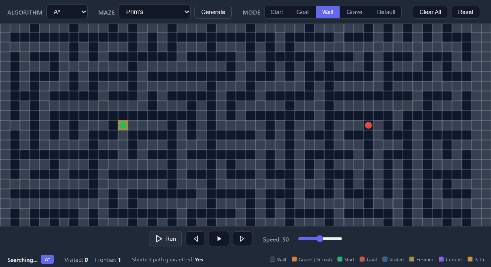

# Algorithm Visualizer

An interactive pathfinding visualizer where you place terrain, walls, and markers on a grid and watch algorithms search for the shortest path.



## Features

- **4 algorithms** — A\*, Dijkstra, BFS, DFS
- **Weighted pathfinding** — A\* and Dijkstra route around costly gravel cells
- **2 maze generators** — Prim's and Recursive Division
- **5 cell types** — default terrain, walls, gravel (2x cost), start, and goal
- **Playback controls** — play, pause, step forward/backward, adjustable speed
- **Live stats** — visited cells, frontier size, path length, shortest-path guarantee

## Quick Start

```bash
npm install
npm run dev
```

Open `http://localhost:5173` in your browser.

## Stack

React 18 &middot; TypeScript &middot; Vite 6 &middot; HTML5 Canvas &middot; CSS Modules

## License

MIT
